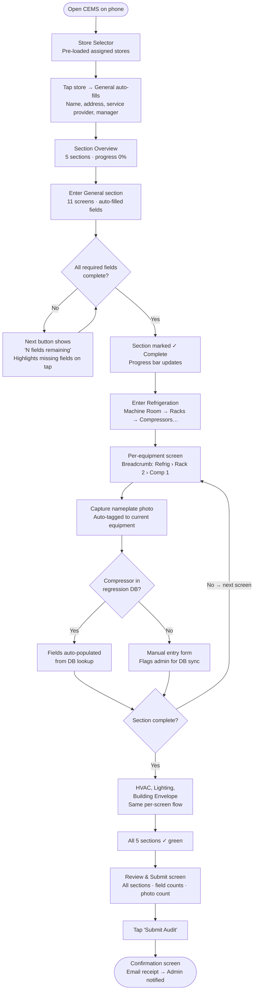
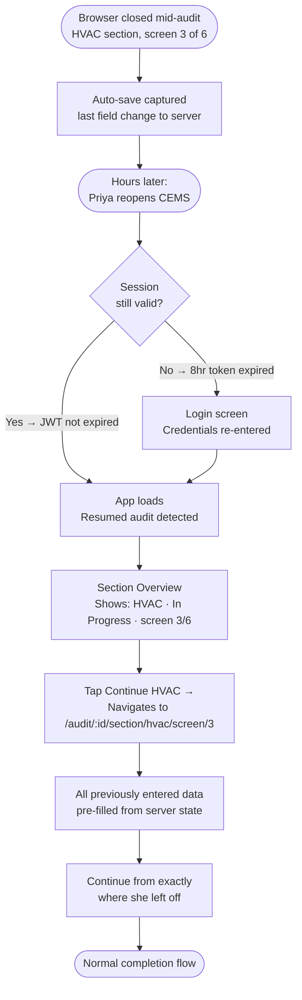
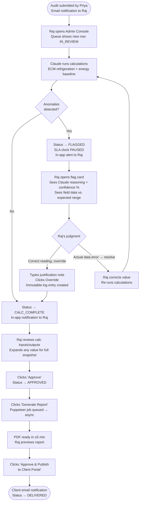
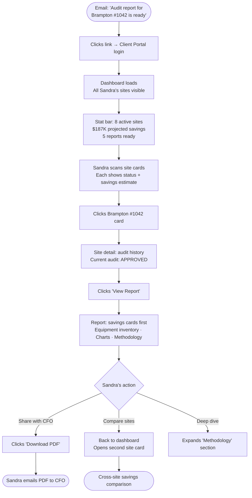

# UX Design Specification Star Energy CEMS

**Author:** Abhishek
**Date:** 2026-04-19

---

<!-- UX design content will be appended sequentially through collaborative workflow steps -->

## Executive Summary

### Project Vision

CEMS closes the entire loop from field data collection to verified energy savings — in one platform. A guided mobile audit workflow enforces complete, consistent data collection at the point of capture; that structured data feeds directly into an engineering calculation engine reviewed by Claude (LLM), culminating in a client-ready proof of energy savings produced automatically — not assembled by hand. For Star Energy, this is the operational infrastructure to scale from 20 to 100+ sites. For clients, it is transparent, multi-site visibility into energy retrofit ROI.

MVP scope: Supermarket sector, three interfaces (Site Audit App / Admin Console / Client Portal), three RBAC roles (Auditor / Admin / Client).

### Target Users

**Auditor (Priya — field technician):** Works on mobile browser in demanding physical environments (machine rooms, variable light, possible gloved use). Currently uses paper forms across 2 days per site. Key needs: guided workflow that prevents missed fields, fast photo capture with zero manual re-association, session resume from any device. Success = full audit done in ≤4 hours with zero follow-up calls.

**Admin (Raj — Star Energy engineer):** Manages 8+ concurrent audits on a desktop. Needs structured incoming data (no re-entry), LLM-assisted calculation review with clear reasoning for anomaly flags, and fast report generation/publishing. Success = report delivered ≤4 hours after audit submission.

**Client (Sandra — retail energy manager):** Manages 40+ locations, previously received Word docs weeks late with no cross-site comparison. Needs transparent, on-demand audit status and report access to justify retrofits internally. Success = self-service visibility into Star Energy's work, downloadable reports for CFO.

### Key Design Challenges

1. **Deep hierarchy on a small screen:** The refrigeration section has 8 nested sub-levels. Presenting this progressively on mobile without losing the auditor's place or overwhelming them is the platform's core UX challenge.
2. **Field-condition usability:** The Site Audit App must function reliably in bright, physically demanding environments — touch targets, contrast, photo capture UX, and cognitive load all require deliberate field-first design decisions.
3. **Human-AI collaboration in the admin workflow:** The LLM anomaly review UI must surface Claude's reasoning clearly enough that Raj can make fast, informed decisions — neither ignoring flags nor blindly accepting them.

### Design Opportunities

1. **Progress as motivation:** A visible, meaningful progress indicator during the audit (time saved vs. paper, sections remaining) can transform a tedious form into a satisfying, completable experience.
2. **Client portal as ROI storytelling:** Sandra's dashboard is not just a report viewer — it is a live energy savings story across her portfolio. Designed well, it becomes a tool Sandra uses to justify retrofit investment to her CFO, and a differentiator that helps Star Energy win more sites.
3. **Transparent AI builds trust:** Claude's anomaly explanations, if surfaced clearly in the admin review interface, can gradually shift the admin's relationship with the AI from skepticism to collaboration — increasing review speed as trust grows over time.

## Core User Experience

### Defining Experience

The heartbeat of CEMS is the auditor completing each section and progressing forward — every downstream capability (calculations, reports, client visibility) depends on this single action being done correctly and completely on-site. For the admin, the parallel defining interaction is the LLM anomaly review: reviewing Claude's flag and making an informed override decision is the moment where the calculation pipeline either flows to delivery or stalls.

### Platform Strategy

| Surface | Platform | Input Mode |
|---|---|---|
| Site Audit App | Mobile browser (iOS Safari, Android Chrome) | Touch-first, one-handed, camera-enabled |
| Admin Console | Desktop web | Mouse + keyboard |
| Client Portal | Desktop web + mobile browser | Mouse/keyboard primary, touch secondary |

No offline mode for MVP (4G+ at all audit sites confirmed). Photo capture via MediaDevices API (rear camera default). Touch targets minimum 44×44pt throughout the audit app.

### Effortless Interactions

- **Photo capture:** One tap → rear camera → photo taken → auto-tagged to current equipment. Zero manual re-association.
- **Auto-save:** Data is always safe. Auditor never thinks about saving. Connectivity indicator is calm and present — not alarming.
- **Store auto-fill:** Store selection pre-populates General section fields (address, service provider, manager data). No manual typing of reference data.
- **Sequential navigation:** "Next" always leads to the next required screen. No menu navigation mid-audit.

**Intentional friction (by design):**
- Progression blocked on incomplete screens (field validation — prevents missing data)
- LLM override requires typed justification (audit trail — protects report quality)
- Report publish requires explicit confirmation (consequential, irreversible action)

### Critical Success Moments

1. **Priya submits at 4 hours** — all sections complete, confirmation shown. Previously Day 1 of 2. The moment CEMS proves its value to the field.
2. **Raj's report is ready in 3.5 hours, not 3 days** — the first time this happens, CEMS is proven to Star Energy's operations.
3. **Sandra sees all 8 of her sites on one dashboard** — comparable, transparent, on-demand. The moment that turns a client into an advocate.

### Experience Principles

1. **Guide, don't gate** — Lead auditors through complexity step by step. Each screen is one job. Never expose the full hierarchy at once.
2. **Invisible reliability** — Data is always saved. The system is always resilient. Reliability is felt through calm UX, not promised in tooltips.
3. **Friction is a feature where it matters** — Override a flag? Justify it. Publish a report? Confirm it. Deliberate friction at consequential moments protects quality.
4. **Transparency builds trust** — Claude's reasoning is visible. Audit state is always readable. Calculation inputs are inspectable. The system earns trust by being open.
5. **Every screen earns its user's time** — Priya is on-site. Raj has 8 audits queued. Sandra has a CFO to brief. No bloat, no filler — immediate value on every screen.

## Desired Emotional Response

### Primary Emotional Goals

- **Auditor:** Competent and in control — the app makes Priya feel like a professional with a professional tool. Not anxious about missed fields or lost data; certain that if the app let her through, the audit is complete.
- **Admin:** Confident and trusted — Raj feels like a command center operator, not a rubber-stamp. He exercises judgment over the AI, not the reverse. The workflow respects his expertise.
- **Client:** Informed and impressed — Sandra's dashboard makes her look good to her CFO. The methodology is transparent, the data is credible, the presentation is professional.

### Emotional Journey Mapping

| Moment | Target Emotion |
|---|---|
| Auditor opens app, selects store | Calm readiness — "I know what to do" |
| Auditor mid-audit, halfway through refrigeration | Momentum — "I'm making progress" |
| Auditor hits a connectivity blip | Calm confidence — "My data is safe" |
| Auditor submits complete audit | Accomplishment — "Done. Faster than ever." |
| Admin opens incoming audit queue | Organized control — "I can see everything" |
| Admin reviews LLM flag | Engaged judgment — "I'm the decision-maker here" |
| Admin publishes report | Satisfaction — "3.5 hours. Used to be 3 days." |
| Client opens dashboard first time | Impressed clarity — "I can see all my stores" |
| Client downloads report for CFO | Professional pride — "This is exactly what I needed" |

### Micro-Emotions

- **Auditor:** Required field blocking should feel like *help*, not punishment — the app is protecting her from a follow-up call, not slowing her down
- **Admin:** LLM anomaly flags should feel *informative*, not alarming — curiosity over anxiety; the flag is an invitation to inspect, not a siren
- **Client:** Site comparison should feel like *discovery*, not overwhelm — insights surface progressively, not all at once

### Design Implications

| Emotion Goal | UX Approach |
|---|---|
| Auditor momentum | Progress indicator with sections + estimated time remaining; satisfying "Next" transitions |
| Auditor certainty | All-sections-green confirmation screen before final submit |
| Auditor calm during connectivity issues | Subtle persistent status indicator; "Saved" micro-confirmation per field; no alarming banners |
| Admin authority over LLM | Flag card prominently shows reasoning + confidence level; override is a primary action, not buried |
| Admin efficiency | Queue sorted by SLA urgency; minimal confirmation dialogs on routine state transitions |
| Client trust | Methodology expandable on demand (transparent but not foregrounded); professional report design |
| Client impression | Energy savings surfaced in human terms (kWh, dollars, CO₂); cross-site comparison in dashboard |

### Emotional Design Principles

1. **Calm over alarm** — Status indicators, error states, and connectivity issues should communicate without alarming. CEMS should feel steady and reliable, not fragile.
2. **Accomplishment at every completion** — Each section submit, each calculation approval, each report published should feel like a real achievement — not just a state change.
3. **Respect expertise** — Auditors know refrigeration. Admins know energy engineering. The UX should feel built for domain experts, not generic users.
4. **Professional credibility throughout** — Every surface a client sees must reflect Star Energy's professional standards. The platform is also a sales tool.

## UX Pattern Analysis & Inspiration

### Inspiring Products Analysis

**Site Audit App:** Typeform / Google Forms (guided sequential forms), Notion Mobile (hierarchy navigation, auto-save)
**Admin Console:** Airtable (queue management, record detail), Vercel Dashboard (pipeline visualization, state-scoped actions)
**Client Portal:** Grafana (drill-down dashboards), Notion Shared Pages (clean read-only, professional typography)

### Transferable UX Patterns

**Navigation Patterns:**
- **Breadcrumb path display** (Notion) → persistent hierarchy position indicator in deep refrigeration screens (Machine Room › Rack 2 › Compressor 3)
- **Overview → drill-down** (Grafana) → client portal: all sites → single site → audit history → report
- **Record detail side panel** (Airtable) → admin expands audit detail without losing queue context

**Interaction Patterns:**
- **One focused task per screen** (Typeform) → each audit screen is one job; related fields visible together, but one screen = one equipment item
- **Progress bar + "X of Y"** (Typeform) → section progress indicator ("Refrigeration: 4 of 8 screens complete")
- **Inline required field + on-attempt validation** (Google Forms) → helpful, not punishing — errors surface when user tries to proceed, not while typing
- **State-scoped action buttons** (Vercel) → "Approve" only appears in CALC_COMPLETE state; "Override" only in FLAGGED state
- **Pipeline step visualization** (Vercel) → audit state machine as a visible progress track in the admin queue
- **Expandable log detail** (Vercel) → calculation inputs/outputs expandable inline in the LLM review panel

**Visual Patterns:**
- **Inline "Saved" micro-confirmation** (Notion) → auto-save indicator, never a modal or toast
- **Color-coded status badges** (Airtable/Vercel) → distinct visual identity per audit state
- **Panel-based site cards** (Grafana) → client dashboard as independent site cards, each a self-contained summary
- **Clean minimal chrome** (Notion, Vercel) → content-forward; no decorative UI furniture competing with data
- **Professional typography + whitespace** (Notion Shared Pages) → client portal and report design tone

### Anti-Patterns to Avoid

- **Grafana-style density and configurability** on the client portal — Sandra is an executive, not a data engineer. Fixed, curated views only; no panel controls or variable dropdowns
- **Airtable-style infinite configuration** in the admin console — focused workflow with state-appropriate actions, not a spreadsheet-everything tool
- **Google Forms' flat "question N of 200" feeling** — CEMS has real hierarchy; auditors must always know their position in the equipment tree
- **Typeform's strict one-at-a-time rigidity** on complex screens — some audit screens (compressor nameplate data) need 6–8 related fields visible together for cross-referencing
- **Notion's freeform non-linear navigation** in the audit wizard — enforced sequential progression is a feature, not a constraint

### Design Inspiration Strategy

**Adopt directly:**
- Typeform's momentum patterns (animated transitions, progress bar, large touch targets) for the audit wizard
- Notion's breadcrumb hierarchy display for refrigeration deep-navigation
- Vercel's state-scoped action buttons and pipeline visualization for the admin console
- Notion Shared Pages' typography and whitespace tone for the client portal

**Adapt:**
- Airtable's record detail panel → slimmed down, read-only summary panel for audit detail in admin queue
- Grafana's drill-down pattern → simplified 3-level drill (portfolio → site → report), no configuration controls
- Google Forms' section breaks → landmark headers in the audit hierarchy, not just "question N of N"

**Avoid:**
- Configuration UX (Airtable/Grafana) on any surface seen by non-admin users
- Freeform navigation patterns (Notion) inside the guided audit wizard
- Flat sequential numbering without hierarchy context in the audit flow

## Design System Foundation

### Design System Choice

**Tailwind CSS 4 + shadcn/ui** — a themeable component system built on Radix UI primitives, with full Tailwind customization. Components are copied into the codebase (`packages/ui/`) giving full ownership with no upstream dependency risk.

### Rationale for Selection

- **Three-surface flexibility:** Same component foundation themed differently per app — field-focused for audit app, data-dense for admin console, executive-clean for client portal
- **LLM-first development:** shadcn/ui has exceptional AI training data coverage, ensuring consistent, idiomatic code across multiple development sessions
- **Accessibility built-in:** Radix UI primitives provide WCAG-compliant focus states, ARIA roles, and keyboard navigation without additional effort
- **Field-condition enforcement:** Tailwind utility classes make touch target requirements (`min-h-[44px]`) trivially consistent across the entire audit app
- **Token-based customization:** Star Energy brand identity applied via CSS variables without fighting component library defaults

### Surface Personalities

| Surface | Design Tone | Tailwind Configuration |
|---|---|---|
| Site Audit App | High contrast, generous spacing, field-focused | Large base font (16px min), high-contrast color pairs, touch-sized controls, reduced visual complexity |
| Admin Console | Data-dense, professional, efficient | Tighter spacing, full data display components (tables, badges, dialogs), SLA-aware status colors |
| Client Portal | Executive clean, brand-forward, credible | Star Energy brand colors prominent, generous whitespace, minimal UI chrome, report-ready typography |

### Implementation Approach

Shared design tokens defined in `packages/config/tailwind/preset.ts` — all three apps inherit the same color palette, spacing scale, and typography with surface-level overrides per app. Base components (Button, Input, Badge, Modal, Table) live in `packages/ui/` and are shared across all apps. Domain-specific components (PhotoCapture, LlmFlagCard, SiteCard) are built per-app in their respective feature modules.

### Customization Strategy

- **Design tokens first:** Color palette, spacing, and typography defined as CSS variables before any component work begins
- **Base → feature layering:** Global base styles in `packages/ui/`; surface-specific overrides in each app's `tailwind.config.ts`
- **No bespoke components for standard UI:** Buttons, inputs, dialogs, tables always from shadcn/ui — custom components only for domain-specific interactions that have no shadcn/ui equivalent

## 2. Core User Experience

### 2.1 Defining Experience

**CEMS's defining experience: A field auditor completes a structured energy audit — entirely on their phone, in 4 hours — with zero missing data and zero follow-up calls.**

The magic moment is the Submit confirmation: all sections green, audit complete. This single interaction unlocks every downstream capability — calculations, reports, client visibility. Everything else in the platform exists because this worked.

For the admin, the parallel defining experience is: reviewing a Claude anomaly flag, exercising engineering judgment, and advancing the audit toward report delivery — with full confidence in the output.

### 2.2 User Mental Model

Auditors currently experience an energy audit as a physical walk-through with paper forms, separate photos, and uncertainty about completeness (discovered later when admin calls). The mental model CEMS maps to is a **pilot's pre-flight checklist** — each item has a clear completion state, and when all items are checked, the work is unambiguously done.

This is an established wizard/checklist pattern applied to a domain (field energy audit) where digital tooling is still uncommon. The innovation is domain-specific intelligence layered on top: auto-fill from reference data, automatic photo tagging, contextual help tooltips — not a novel interaction model.

### 2.3 Success Criteria

The audit wizard succeeds when:
- Auditor navigates every section without consulting documentation
- Auto-save is always active; auditor never thinks about saving
- Required field blocks feel like a guide ("you haven't filled in rack model"), not a wall
- Photos are auto-tagged at point of capture — zero manual re-association
- Browser close + reopen resumes exactly where the auditor left off
- Submit screen shows all sections green — unambiguous completion certainty

The audit wizard fails when:
- A section is discovered incomplete at submit time (should have been caught per-screen)
- Connectivity issues cause visible panic or data loss anxiety
- Refrigeration hierarchy depth leaves the auditor disoriented
- Required field blocking feels punitive rather than protective

### 2.4 Novel UX Patterns

| Interaction | Pattern | Approach |
|---|---|---|
| Sequential section wizard | Established | Adopt multi-step form model — users know this from Typeform/Google Forms |
| Refrigeration hierarchy navigation | Novel challenge | Breadcrumb + progressive drill-down — familiar metaphor for unfamiliar depth |
| Auto-tagged photo capture | Novel in this domain | One-tap → rear camera → auto-tag to current equipment — no education needed |
| Section lock ("In progress by Priya") | Established | Collaborative editing indicator — Google Docs-style, intuitively understood |
| Auto-save with connectivity status | Established | Notion-style "Saved ✓" micro-confirmation — already familiar to users |

### 2.5 Experience Mechanics — Audit Wizard

**Initiation:**
Store Selector → tap assigned store → General section auto-fills → "Start Audit" → Section Overview (5 sections with status indicators: Not Started / In Progress / Complete)

**Interaction (per screen):**
- One screen = one equipment item or one logical data group
- Fields top-to-bottom with inline `?` help icons; required fields marked
- Photo capture: tap icon → rear camera → capture → thumbnail with auto-tag label → "Next"
- "Next" enabled when all required fields complete; disabled with count label ("3 required fields remaining") when not

**Feedback:**
- Field change → silent background save → "Saved ✓" badge (fades after 2s)
- Connectivity loss → persistent "Reconnecting…" banner; no modal, no data loss
- Required field blocked → "Next" tap highlights unfilled fields (shake + red border); no dismissible dialog
- Section complete → checkmark animates onto section in overview

**Completion:**
- "Review & Submit" screen: all 5 sections as green checkmarks with field counts
- "Submit Audit" — large, prominent, only enabled when all sections green
- Post-submit: confirmation screen + email receipt

## Visual Design Foundation

### Color System

**Brand Source:** Star Energy website (logo mark: blue + amber + green three-arrow motif)

#### Design Tokens

```css
/* Primary Brand */
--color-primary:        #1B6BDB;  /* Blue — buttons, links, active states */
--color-primary-hover:  #1558B8;
--color-primary-light:  #EFF4FF;  /* Tinted backgrounds */

/* Semantic States */
--color-success:        #2E7D32;  /* Green — completed sections, approved, saved */
--color-success-light:  #F0FDF4;
--color-warning:        #F5A623;  /* Amber — LLM flags, connectivity warnings, pending */
--color-warning-light:  #FFFBEB;
--color-danger:         #DC2626;  /* Red — required field errors, blocked states */
--color-danger-light:   #FEF2F2;

/* Brand Highlight */
--color-highlight:      #E8850A;  /* Orange — energy savings callouts, CTAs in client portal */

/* Surfaces */
--color-surface-dark:   #111827;  /* Admin sidebar, nav bars */
--color-surface-light:  #F9FAFB;  /* App backgrounds */
--color-surface-white:  #FFFFFF;  /* Card backgrounds, form fields */
--color-border:         #E5E7EB;  /* Dividers, input borders */

/* Text */
--color-text-primary:   #111827;  /* Body text */
--color-text-secondary: #6B7280;  /* Labels, captions, helper text */
--color-text-inverse:   #FFFFFF;  /* Text on dark backgrounds */
```

#### Audit State Color Mapping

| Audit State | Color | Token |
|---|---|---|
| DRAFT | Gray | `--color-text-secondary` |
| IN_REVIEW | Blue | `--color-primary` |
| FLAGGED | Amber | `--color-warning` |
| CALC_COMPLETE | Blue (bright) | `--color-primary` |
| APPROVED | Green | `--color-success` |
| DELIVERED | Green (muted) | `--color-success-light` |
| CLOSED | Gray | `--color-border` |

#### Surface Color Personalities

| Surface | Background | Sidebar/Nav | Primary Action |
|---|---|---|---|
| Site Audit App | `#F9FAFB` | None (full-width mobile) | `#1B6BDB` |
| Admin Console | `#F9FAFB` | `#111827` (dark) | `#1B6BDB` |
| Client Portal | `#FFFFFF` | `#111827` (dark) | `#1B6BDB` |

### Typography System

**Font Family:** Inter (Google Fonts) — clean, professional, exceptional screen legibility, industry-standard for SaaS and data-dense interfaces.

```css
--font-sans: 'Inter', system-ui, -apple-system, sans-serif;
```

#### Type Scale

| Token | Size | Weight | Line Height | Usage |
|---|---|---|---|---|
| `text-xs` | 12px | 400 | 1.5 | Captions, timestamps, helper text |
| `text-sm` | 14px | 400 | 1.5 | Secondary body, table rows, labels |
| `text-base` | 16px | 400 | 1.6 | Primary body text, form fields |
| `text-lg` | 18px | 500 | 1.5 | Section headings, card titles |
| `text-xl` | 20px | 600 | 1.4 | Page sub-headings |
| `text-2xl` | 24px | 700 | 1.3 | Page titles |
| `text-3xl` | 30px | 700 | 1.2 | Hero metrics (client portal KPIs) |

**Audit App minimum:** `text-base` (16px) enforced as minimum for all field labels and inputs.

### Spacing & Layout Foundation

**Base unit:** 4px. All spacing is multiples of 4.

**Site Audit App (mobile):** Single column, full-width. `px-4` padding. `min-h-[44px]` touch targets everywhere. Bottom-anchored "Next" button (thumb-reachable zone).

**Admin Console (desktop):** Fixed dark sidebar (240px) + main content. Compact table rows (40px). Side panel for audit detail (480px, slides from right).

**Client Portal (desktop + mobile):** `max-w-6xl` centered. Responsive site card grid (3-col → 2-col → 1-col). Report view `max-w-3xl`, generous whitespace — document reading experience.

### Accessibility Considerations

- **Contrast:** All pairs meet WCAG AA (4.5:1 min). Primary blue `#1B6BDB` on white = 4.8:1 ✓
- **Dark mode:** Post-MVP — light-only at launch
- **Touch targets:** `min-h-[44px] min-w-[44px]` across entire audit app (NFR-A1)
- **Color independence:** All status indicators include text labels or icons — never color alone (NFR-A2)
- **Focus states:** Radix UI / shadcn/ui keyboard-accessible focus rings out of the box
- **Font size floor:** 16px minimum in audit app; 14px minimum in admin/client surfaces

## Design Direction Decision

### Design Directions Explored

Six key screens explored across all three surfaces:
- **A** — Site Audit App: Section Overview (mobile checklist with progress bar)
- **B** — Site Audit App: Compressor Data Entry (field form with breadcrumb + photo capture)
- **C** — Admin Console: Audit Queue (dark sidebar + state-scoped action table)
- **D** — Admin Console: LLM Flag Review (flag card with reasoning + calculation results panel)
- **E** — Client Portal: Multi-Site Dashboard (stat cards + site card grid with savings metrics)
- **F** — Site Audit App: Review & Submit (all-sections-green confirmation before submit)

Interactive showcase: `_bmad-output/planning-artifacts/ux-design-directions.html`

### Chosen Direction

All six directions confirmed as the design foundation for CEMS. Each screen represents the target design for its respective surface and workflow moment.

### Design Rationale

- **Audit App:** Checklist-forward section overview gives auditors immediate orientation; breadcrumb navigation solves the deep refrigeration hierarchy problem; bottom-anchored "Next" button stays in thumb reach throughout
- **Admin Console:** Dark sidebar establishes command-center authority; state-colored badges make queue scanning instant; LLM flag card surfaces reasoning prominently with override requiring typed justification
- **Client Portal:** Savings-first card hierarchy puts dollar impact before technical detail; site card grid enables portfolio-level comparison; report design mirrors professional document standards

### Implementation Notes

- `ux-design-directions.html` is the living visual reference for all implementation stories
- Design tokens are the authoritative source — implement in `packages/config/tailwind/preset.ts` before any component work
- All six screen mockups translate directly to story-level implementation targets

## User Journey Flows

### Journey 1 — Priya: Completing a Full Supermarket Audit (Success Path)



**Key UX decisions:** Auto-fill at store selection removes first 10 minutes of form work. Breadcrumb solves hierarchy disorientation across 8 refrigeration sub-levels. "N fields remaining" on the Next button is the only validation feedback needed. Compressor DB miss surfaces immediately, doesn't block auditor. Submit is gated behind all-green — certainty is built in.

---

### Journey 2 — Priya: Interrupted Audit (Session Resume)



**Key UX decisions:** `current_section_id` + `current_screen_id` stored server-side on every field change — deep link resume is always accurate. 8-hour JWT covers a full workday without re-login. Section Overview as resume landing point — not a blank screen.

---

### Journey 3 — Raj: Calculation Review & Report Publication



**Key UX decisions:** SLA clock pause at FLAGGED is visible in the queue. Flag card shows reasoning before action buttons — Raj reads before deciding. Override requires typed justification with immutable log entry. "Approve & Publish" is one action — no multi-step publishing wizard.

---

### Journey 4 — Sandra: First-Time Client Portal Visit



**Key UX decisions:** Email deep-links directly to dashboard — Sandra never hunts for her report. Portfolio stats load first — $187K across 8 sites is the headline. Methodology collapsed by default — credibility without mandatory complexity. PDF download is one tap from anywhere in the report.

---

### Journey Patterns

| Pattern | Description | Used In |
|---|---|---|
| **Progressive validation** | Errors surface when user attempts to proceed, not while typing | All audit form screens |
| **State-scoped actions** | Action buttons rendered only when valid for current state | Admin queue, audit detail |
| **Auto-resume** | Server-stored position enables exact-screen resume after interruption | Audit wizard |
| **Async with status polling** | Long operations return immediately with job ID; UI polls for completion | Admin calculation, report generation |
| **Confirmation before irreversible** | Submit and Approve & Publish require explicit final action | Audit submit, report publish |
| **Deep-link entry** | Email notifications link directly to relevant screen, not home page | All notification flows |

### Flow Optimization Principles

1. **Minimize steps to value** — auto-fill, auto-tag, and auto-resume eliminate the most common sources of auditor friction before they occur
2. **Never block without explaining** — every disabled state tells the user exactly what's needed to proceed
3. **Async operations are never blocking** — calculation and PDF generation return immediately; status polling keeps UI live
4. **Every consequential action is one deliberate tap** — no accidental submissions, approvals, or publishes

## Component Strategy

### Design System Components (shadcn/ui → `packages/ui/`)

| Component | Usage in CEMS |
|---|---|
| `Button` | All CTAs — Next, Submit, Approve, Override, Download PDF |
| `Input` / `Textarea` | All audit form fields |
| `Select` / `Combobox` | Refrigerant type, dropdown fields |
| `Badge` | Audit state pills |
| `Table` | Admin audit queue, reference data management |
| `Dialog` / `AlertDialog` | Confirmation dialogs (publish, submit) |
| `Tooltip` | Field help tooltips (`?` icons) |
| `Sheet` | Admin side panel (audit detail, slides from right) |
| `Progress` | Section progress bar |
| `Skeleton` | Loading states |
| `Toast` | Post-submit and publish confirmations |
| `Avatar` | User identity in sidebar/topbar |

### Custom Components

**`SectionProgressBar`** — `audit-app/features/audit/components/SectionProgress.tsx`
Progress track + "2 of 5 sections" label. States: `in-progress` (blue), `complete` (green).

**`SectionCard`** — `audit-app/features/audit/components/SectionCard.tsx`
One card per audit section in Section Overview. States: `not-started`, `in-progress` (blue border), `complete` (green + ✓), `locked-by-other` (amber + "In Progress by [name]"). Keyboard focusable with `role="button"`.

**`AuditBreadcrumb`** — `audit-app/features/audit/components/AuditBreadcrumb.tsx`
Compact hierarchy path (Refrig › Rack 2 › Compressor 1). Clickable segments navigate up; current item non-clickable. Truncates with ellipsis if needed.

**`AutoSaveIndicator`** — `audit-app/features/audit/components/AutoSaveIndicator.tsx`
States: `saved` (✓ Saved, fades after 2s), `saving` (subtle spinner), `reconnecting` (amber persistent banner), `offline` (red persistent banner with time-since-saved). Never a modal. Offline/reconnecting are top-of-screen banners; saved/saving are inline micro-confirmations.

**`PhotoCaptureField`** — `audit-app/features/photos/components/CameraCapture.tsx`
States: `empty` (dashed border CTA), `uploading` (progress), `uploaded` (thumbnail + auto-tag label), `failed` (retry). `aria-label="Capture [photo type] photo"`. Keyboard fallback via file input.

**`LlmFlagCard`** — `admin-app/features/calc-review/components/LlmFlagCard.tsx`
Flag header (icon + title + confidence %) → reasoning text → actual vs. expected data → Override / Accept buttons → justification textarea (revealed on Override). Override button disabled until justification is non-empty. States: `open`, `resolved-override`, `resolved-accepted`.

**`AuditStatusBadge`** — `admin-app/features/audit-queue/components/AuditStatusBadge.tsx`
One variant per audit state. Always includes text label alongside color — never color alone (NFR-A2).

**`SlaTimer`** — `admin-app/features/audit-queue/components/SlaTimer.tsx`
States: `ok` (green, >3h), `warning` (amber, 1–3h), `urgent` (red, <1h), `paused` (gray "SLA clock paused").

**`SiteCard`** — `client-portal/features/dashboard/components/SiteCard.tsx`
Site name + status badge → savings metrics (cost + kWh) → report date + "View Report →". States: `report-ready`, `in-progress` (metrics show "Calculating…"), `not-started`.

### Implementation Roadmap

**Phase 1 — Sprint 1 (blocks all other work):**
`AutoSaveIndicator`, `SectionCard`, `SectionProgressBar`, `AuditBreadcrumb`, `AuditStatusBadge`

**Phase 2 — Sprint 2 (core audit + admin flows):**
`PhotoCaptureField`, `LlmFlagCard`, `SlaTimer`

**Phase 3 — Sprint 3 (client portal + polish):**
`SiteCard`, all shadcn/ui base components wired to Star Energy design tokens

## UX Consistency Patterns

### Button Hierarchy

| Level | Style | Usage |
|---|---|---|
| **Primary** | Solid blue `#1B6BDB`, full-width on mobile | One per screen max — Next, Submit Audit, Approve, Generate Report |
| **Secondary** | Outlined, blue text | Supporting actions: Save Draft, Back, Cancel |
| **Destructive** | Solid red `#DC2626` | Irreversible deletions only |
| **Ghost** | No border, blue text | Tertiary: View Details, Expand, Help |
| **Disabled** | Gray bg + text | Always shows reason label ("3 required fields remaining") — never silently disabled |

- On mobile: primary button anchored to bottom of viewport — always thumb-reachable
- Destructive actions require `AlertDialog` confirmation before execution

### Form Validation Patterns

**Attempt-first validation** — errors surface when user tries to proceed, not while typing.

| Scenario | Behaviour |
|---|---|
| Empty required field, user taps Next | Red border + shake animation on unfilled fields. No modal. |
| Field filled correctly | Border turns green (`#BBF7D0` bg). Silent — no toast. |
| Field format error | Inline message below field on blur, not on keystroke. |
| Compressor model not in DB | Inline amber alert: "Model not found — enter specs manually. Admin will be notified." |
| External API timeout | Inline amber alert on affected field: "Auto-fill unavailable — enter manually." Never blocks progression. |

- Error messages describe the fix ("Enter a value between 1–999"), not the problem ("Invalid input")
- Required fields always marked with `*` — never hidden until error state

### Feedback & Status Patterns

| Situation | Pattern | Duration |
|---|---|---|
| Auto-save successful | "✓ Saved" green badge, fades | 2 seconds |
| Connectivity lost | "Reconnecting…" amber top banner | Persistent until restored |
| Offline | "Offline — last saved Xm ago" red banner | Persistent |
| Async job running (calc, PDF) | Inline job status card with spinner | Until complete |
| Async job complete | Status card updates + action button appears | Persistent |
| Async job failed | "Failed — [reason]. Retry?" | Persistent until resolved |
| Audit submit success | Full-screen confirmation | Stays |
| Admin action success | `Toast` | 4 seconds |

- Modals only for irreversible confirmations — never for informational feedback
- Top banners never stack — most severe wins

### Navigation Patterns

**Audit App (mobile):** Linear wizard navigation — Next/Back within sections. Back in topbar navigates up hierarchy. Section Overview always reachable via breadcrumb. Every screen has a stable URL.

**Admin Console (desktop):** Fixed left sidebar always visible. Audit detail opens as `Sheet` — never navigates away from queue. `Esc` closes any Sheet or Dialog.

**Client Portal:** Top nav only (no sidebar). Maximum 3 levels: Dashboard → Site Detail → Report. TOC for in-page report navigation.

### Loading & Empty States

| State | Pattern |
|---|---|
| Initial page load | Skeleton UI matching layout — never spinner overlay |
| Queue with no results | Empty state + message + clear filter CTA |
| No completed reports | "Your first report will appear here once approved by Star Energy" |
| Calculation running | Inline job card — page remains interactive |

### Modal & Overlay Patterns

| Use case | Component | Confirmation? |
|---|---|---|
| Submit audit | `AlertDialog` | Yes — "Cannot be undone" |
| Approve & publish report | `AlertDialog` | Yes — "Report becomes immutable" |
| LLM override | Inline in `LlmFlagCard` | Yes — typed justification required |
| Audit detail (admin) | `Sheet` side panel | No |
| Field help | `Tooltip` | No |

- `AlertDialog` for irreversible actions only — overuse creates alert fatigue
- `Sheet` preferred over full-page navigation for detail views
- All dialogs closeable via `Esc` and explicit Cancel — never trapping

## Responsive Design & Accessibility

### Responsive Strategy

**Site Audit App — Mobile-first (320px–767px primary)**

The audit app is designed and tested for mobile first. No desktop variant exists for MVP. Single-column, full-width layout throughout. Bottom-anchored primary action button stays in thumb-reach zone. Breadcrumb truncates with ellipsis on narrow viewports (`max-w-[60vw]` with `overflow: hidden`).

Touch-first considerations beyond 44×44pt minimum: all interactive targets sized for gloved operation (targeting 48×48pt on compressor/photo screens). One-handed use assumed — no swipe gestures that require two hands; all primary actions reachable without grip shift.

*Sandra's mobile portal use case (identified in product review):* While the admin console is desktop-only, the Client Portal must fully support Sandra accessing reports from her phone. Portal layout collapses gracefully from 3-column to 1-column — this is a legitimate primary use case, not an edge case.

**Admin Console — Desktop-first (1024px+)**

Desktop-only for MVP. Fixed 240px sidebar remains fixed at all desktop widths. At exactly 1024px (narrow desktop/large tablet), the admin table renders with priority columns only: Status, Site Name, Auditor, SLA Timer. Secondary columns (ECM count, last update) are hidden at this breakpoint via `hidden lg:table-cell`. No responsive mobile layout for admin at MVP.

**Client Portal — Responsive all breakpoints**

Three-column site card grid (`grid-cols-3`) collapses to two (`grid-cols-2`) at 768px and one (`grid-cols-1`) at 480px. Implemented as: `grid grid-cols-1 sm:grid-cols-2 lg:grid-cols-3`. Report view (`max-w-3xl`) is single-column at all sizes; no responsive changes needed. Top navigation collapses to hamburger menu on mobile.

### Breakpoint Strategy

**Standard Tailwind breakpoints used throughout CEMS:**

| Breakpoint | Token | Range | Primary Surface |
|---|---|---|---|
| Default | — | 0–479px | Audit App, Portal mobile |
| `sm` | 480px | 480–767px | Portal card layout (2-col) |
| `md` | 768px | 768–1023px | Portal full navigation |
| `lg` | 1024px | 1024–1279px | Admin console minimum, Portal 3-col |
| `xl` | 1280px | 1280px+ | Admin wide table, Portal max-width |

**Breakpoint tokens live in `packages/config/tailwind/preset.ts`** — all three apps inherit from the shared preset. Surface-specific overrides defined in each app's `tailwind.config.ts`. No custom breakpoints; standard Tailwind breakpoints are sufficient and align with target device matrix.

**Font loading / CLS:** Inter loaded via `<link rel="preload">` with `font-display: swap`. Layout metrics do not shift on font load — system-ui fallback stack has near-identical character width. Implemented at `packages/ui/globals.css`.

**Performance budget per surface:**
- Audit App: LCP ≤2.5s on 4G (field condition baseline); JS bundle ≤200KB gzipped
- Admin Console: LCP ≤3s on broadband; no mobile performance target
- Client Portal: LCP ≤3s on 4G (Sandra mobile use case); JS bundle ≤250KB gzipped

### Accessibility Strategy

**Target:** WCAG 2.1 Level AA across all three surfaces.

**Contrast ratios — field-condition hardened:**

The audit app's operating environment (bright sunlight, machine rooms) demands contrast above the AA minimum of 4.5:1. Primary text pairs are targeted at 5.5:1+ for field use.

| Pair | Ratio | Surface | Notes |
|---|---|---|---|
| `#1B6BDB` on `#FFFFFF` | 4.8:1 | Admin, Portal | Meets AA; acceptable for desktop |
| `#1558B8` on `#FFFFFF` | 6.1:1 | Audit App CTAs | Use hover-state blue for field contrast |
| `#111827` on `#F9FAFB` | 16:1 | Body text all surfaces | Well above requirement |
| `#6B7280` on `#FFFFFF` | 4.6:1 | Secondary text | Meets AA minimum |
| `#FFFFFF` on `#1B6BDB` | 4.8:1 | Button text | Meets AA |
| `#FFFFFF` on `#2E7D32` | 5.1:1 | Success states | Meets AA |
| `#FFFFFF` on `#DC2626` | 4.5:1 | Danger/error | Meets AA exactly — monitor closely |

**Disabled state contrast:** Disabled controls use `#9CA3AF` text on `#F3F4F6` background = 2.6:1. This does not meet AA for text, which is intentional and WCAG-permitted for disabled UI components (SC 1.4.3 exception). Disabled state is always accompanied by a text label explaining what action is required to enable.

**Field-condition accessibility requirements (Audit App only):**

These are beyond WCAG AA and are product requirements for the audit app context:

- Minimum touch target: `min-h-[48px] min-w-[48px]` on compressor and photo capture screens (above 44pt minimum; gloved operation)
- Bottom-anchored primary button: `fixed bottom-0 left-0 right-0` with `pb-safe` (iOS safe area inset) — never blocked by keyboard
- Sunlight mode contrast: Primary actions use `#1558B8` (not `#1B6BDB`) on audit app — 6.1:1 baseline
- No audio-only feedback — all status communication is visual + haptic (vibration API where supported)
- Camera permission denied: Graceful degradation to file input (`<input type="file" accept="image/*" capture="environment">`) — audit continues without native camera UX

**Alt text for photos — implementation spec:**

Equipment photos taken during audits require structured alt text for accessibility and audit log completeness.

```typescript
// packages/ui/utils/generateAltText.ts
export function generatePhotoAltText(
  equipmentType: string,
  equipmentId: string,
  photoType: 'nameplate' | 'overview' | 'damage' | 'other',
  sectionContext: string
): string {
  return `${equipmentType} ${photoType} photo — ${sectionContext}, ID ${equipmentId}`;
  // Example: "Compressor nameplate photo — Refrigeration › Rack 2 › Compressor 1, ID COMP-1042-R2C1"
}
```

Fallback when equipment ID not yet assigned: `"${equipmentType} ${photoType} photo — pending equipment ID"`. This function is called at photo capture time by `PhotoCaptureField` and stored alongside the photo URL.

**LLM-generated report content:** Alt text for AI-generated charts in reports is generated by the calculation service at render time and stored as a structured field in the report schema. Not generated client-side.

**Screen reader compatibility:**

- Radix UI / shadcn/ui primitives provide WCAG-compliant ARIA roles and keyboard behavior out of the box
- `AuditBreadcrumb` uses `<nav aria-label="Audit navigation">` with `<ol>` structure
- `SectionCard` uses `role="button"` with `aria-label="[Section name]: [status]"` and `aria-disabled` when locked
- `AutoSaveIndicator` uses `aria-live="polite"` (not assertive) — status updates announced without interrupting screen reader flow
- `LlmFlagCard` uses `role="region"` with `aria-label="Anomaly flag: [flag title]"`
- `SlaTimer` uses `aria-label="SLA timer: [time remaining]"` updated on each render

**Keyboard navigation:** All interactive elements reachable and operable via keyboard. Tab order follows visual reading order. Focus never trapped (except in dialogs, which follow ARIA modal pattern). `Esc` closes all dialogs and sheets. Skip-to-main-content link at top of each page (`sr-only` positioned, visible on focus).

**Color blindness:** All status indicators include text labels or icons alongside color — never color alone (design token `NFR-A2`). Status badge text + icon covers deuteranopia (red-green), protanopia (red), and tritanopia (blue-yellow) cases.

### Testing Strategy

**Automated accessibility testing — integrated into CI:**

`@axe-core/vitest` integrated into Vitest test suite. Route-level axe scans run against all primary routes:

```typescript
// Example: audit-app/src/routes/__tests__/section-overview.a11y.test.tsx
import { axe } from 'vitest-axe';
describe('SectionOverview accessibility', () => {
  it('has no violations', async () => {
    const { container } = render(<SectionOverview ... />);
    expect(await axe(container)).toHaveNoViolations();
  });
});
```

`eslint-plugin-jsx-a11y` enabled in all three apps' ESLint config — catches common accessibility issues at author time (missing alt text, invalid ARIA, click events without keyboard handlers).

Accessibility acceptance criteria are part of each story's Definition of Done, not a separate audit phase. Story AC includes: "Component passes axe-core scan with zero violations."

**Responsive regression testing:**

Playwright visual regression tests cover all three surfaces at defined viewport widths: 375px (iPhone SE), 390px (iPhone 14), 768px (iPad), 1024px (narrow desktop), 1280px (standard desktop). Tests run on every PR.

**Manual screen reader testing (by risk tier):**

Staged approach to manage scope:

| Tier | Surfaces | AT Tooling | Frequency | Owner |
|---|---|---|---|---|
| Tier 1 (High risk) | Audit App — section wizard, photo capture | VoiceOver + iOS Safari | Each sprint | Frontend lead |
| Tier 2 (Medium risk) | Admin Console — queue, flag card | NVDA + Chrome (Windows) | Pre-release | QA |
| Tier 3 (Lower risk) | Client Portal — dashboard, report view | VoiceOver + Safari (Mac) | Quarterly | QA |

*Note:* "Owner" means designated responsible party on the sprint team. AT testing must have a named owner and be tied to sprint AC before it can be considered done.

**Physical device field testing:**

At minimum one field test on an actual Android device (target: mid-range Samsung Galaxy A-series, representing auditor hardware reality) and one iPhone before each audit app release. Emulator testing does not substitute for physical device testing on touch target sizing, camera behavior, and real 4G network conditions.

**Color blindness simulation testing:**

Chrome DevTools color blindness emulation (Deuteranopia, Protanopia, Tritanopia) run on all status-critical screens quarterly — not per sprint. Trigger: any change to color tokens or status badge components.

### Implementation Guidelines

**Responsive development:**

- Use relative units: `rem` for typography, `%`/`vw`/`vh` for layout, `px` for borders and shadows only
- Mobile-first media queries: base styles are mobile; `md:`, `lg:`, `xl:` add complexity upward
- All breakpoints defined in `packages/config/tailwind/preset.ts` shared config — no app-level breakpoint overrides
- Touch targets: `min-h-[44px] min-w-[44px]` globally; `min-h-[48px] min-w-[48px]` on audit app equipment + photo screens
- Images: `srcset` with 1×/2× variants for all equipment photos; `loading="lazy"` on below-fold images
- Viewport meta: `<meta name="viewport" content="width=device-width, initial-scale=1, maximum-scale=5">` — do NOT set `user-scalable=no` (accessibility violation)

**Accessibility development:**

- Semantic HTML first: `<main>`, `<nav>`, `<section>`, `<article>`, `<button>`, `<form>` — ARIA supplements, never replaces
- ARIA labels: all icon-only buttons require `aria-label`; all landmark regions require `aria-label` when more than one of same type exists on page
- Focus management: on dialog open, focus moves to first interactive element; on close, focus returns to trigger element
- Skip link: `<a href="#main-content" class="sr-only focus:not-sr-only">Skip to main content</a>` in every app's root layout
- `jsx-a11y` ESLint plugin enforced in CI — zero warnings policy
- High contrast mode: CSS `@media (forced-colors: active)` — use `ButtonFace`/`ButtonText` system colors for interactive elements; test in Windows High Contrast Mode before each release

**Browser support matrix:**

| Browser | Audit App | Admin Console | Client Portal |
|---|---|---|---|
| iOS Safari (last 2 major) | **Primary** | — | Supported |
| Android Chrome (last 2 major) | **Primary** | — | Supported |
| Chrome desktop (last 2 major) | — | **Primary** | **Primary** |
| Firefox desktop (last 2 major) | — | Supported | Supported |
| Safari desktop (last 2 major) | — | Supported | Supported |
| Edge desktop (last 2 major) | — | Supported | Supported |
| Samsung Internet | Not supported (MVP) | — | — |

*Note:* Browser matrix should be validated against actual client IT environments before sprint 1 begins. John flagged that enterprise clients may have policy-locked browser versions — confirm with Star Energy whether any client uses managed Chrome or Edge with extended support channels.

**Offline / connectivity handling:**

No offline mode for MVP (4G+ confirmed at all audit sites). However, brief connectivity drops are expected in machine rooms. Strategy: all form data is server-persisted on every field change; `AutoSaveIndicator` surfaces connection state (`saved` → `reconnecting` → `offline`) without alarming the user. If connectivity is lost for >30 seconds, amber banner persists: "Offline — last saved [X]m ago. Your data is safe." No local queue or service worker for MVP. Cross-reference: `AutoSaveIndicator` component spec (Component Strategy section).
